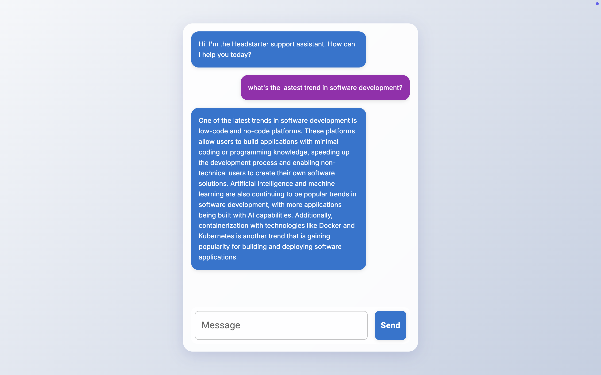

# Headstarter Support Assistant

A modern, real-time chat interface built with Next.js and Material-UI, designed to provide seamless communication between users and the Headstarter support assistant.

## Features

- Real-time chat interface with streaming responses
- Modern UI with smooth animations and transitions
- Responsive design that works on all devices
- Material-UI components for consistent styling
- Error handling and loading states
- Enter key support for quick message sending

## Demo



## Getting Started

First, install the dependencies:

```bash
npm install
# or
yarn install
```

Then, run the development server:

```bash
npm run dev
# or
yarn dev
```

Open [http://localhost:3000](http://localhost:3000) with your browser to see the application.

## Project Structure

- `app/page.js` - Main chat interface component
- `app/globals.css` - Global styles and theme configuration
- `app/api/chat` - API endpoint for handling chat requests

## Technologies Used

- [Next.js](https://nextjs.org/) - React framework
- [Material-UI](https://mui.com/) - UI component library
- [React](https://reactjs.org/) - JavaScript library for building user interfaces

## Development

The main chat interface can be modified in `app/page.js`. The page auto-updates as you edit the file.

## Deployment

The application can be easily deployed on [Vercel](https://vercel.com/), the platform from the creators of Next.js.

```bash
npm run build
# or
yarn build
```

## Contributing

Contributions are welcome! Please feel free to submit a Pull Request.

## License

This project is licensed under the MIT License.
